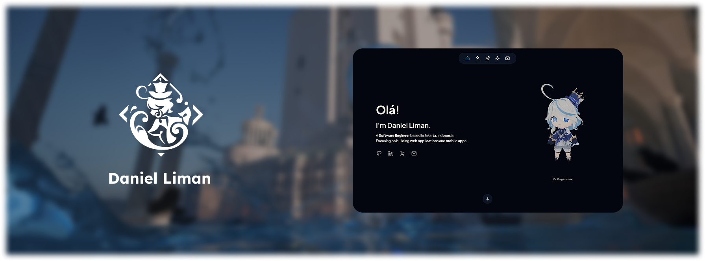

[](#)


# Portofolio Project ─ dnlmn-web

This is my portfolio website project, built with [Next.js](https://nextjs.org/) and [Tailwind CSS](https://tailwindcss.com/). I created this project as part of my journey into website development and to further explore the Next.js framework. Along the way, I also learned 3D modeling with [Blender](https://www.blender.org/) and integrated 3D models with animation into my site using the [Three.js](https://threejs.org/) library. There's still plenty of room for improvement, and I'll continue to work on it in the future!

Special credits to some assets I used in this website:
- Genshin Wiki [(Link)](https://genshin-impact.fandom.com/wiki/Furina/Gallery/)
- Lucide [(Link)](https://lucide.dev/)
- Furina MMD Model from 好想吃番茄味肥牛饭 [(Link)](https://www.aplaybox.com/details/model/e19BJnS8sZxH)

<br>

## ⚙️ Development Setup

To run the project in your local workspace, configure the `.env.local` file to set up enviroment variable and secrets. You can use the `.env.example` template that I put in the root directory.

```.env
# Spotify API
SPOTIFY_CLIENT_ID=xxxx
SPOTIFY_CLIENT_SECRET=xxxx
SPOTIFY_REFRESH_TOKEN=xxxx

# EmailJS
EMAILJS_SERVICE_ID=xxxx
EMAILJS_TEMPLATE_ID=xxxx
EMAILJS_PUBLIC_KEY=xxxx
EMAILJS_PRIVATE_KEY=xxxx
```
Kindly sets your own Spotify API App on the [Spotify Developer](https://developer.spotify.com/) dashboard and [Email.js](https://www.emailjs.com/) account for emailing system.


After configurating the environment variable, install the required package with `npm` or `pnpm`,
```bash
npm install
#or
pnpm install
```

and finally, run the development version of the website using commands below:
```bash
npm run dev
# or
pnpm dev
```
(... or with the other package manager!)

Open [http://localhost:3000](http://localhost:3000) with your browser to see the result.